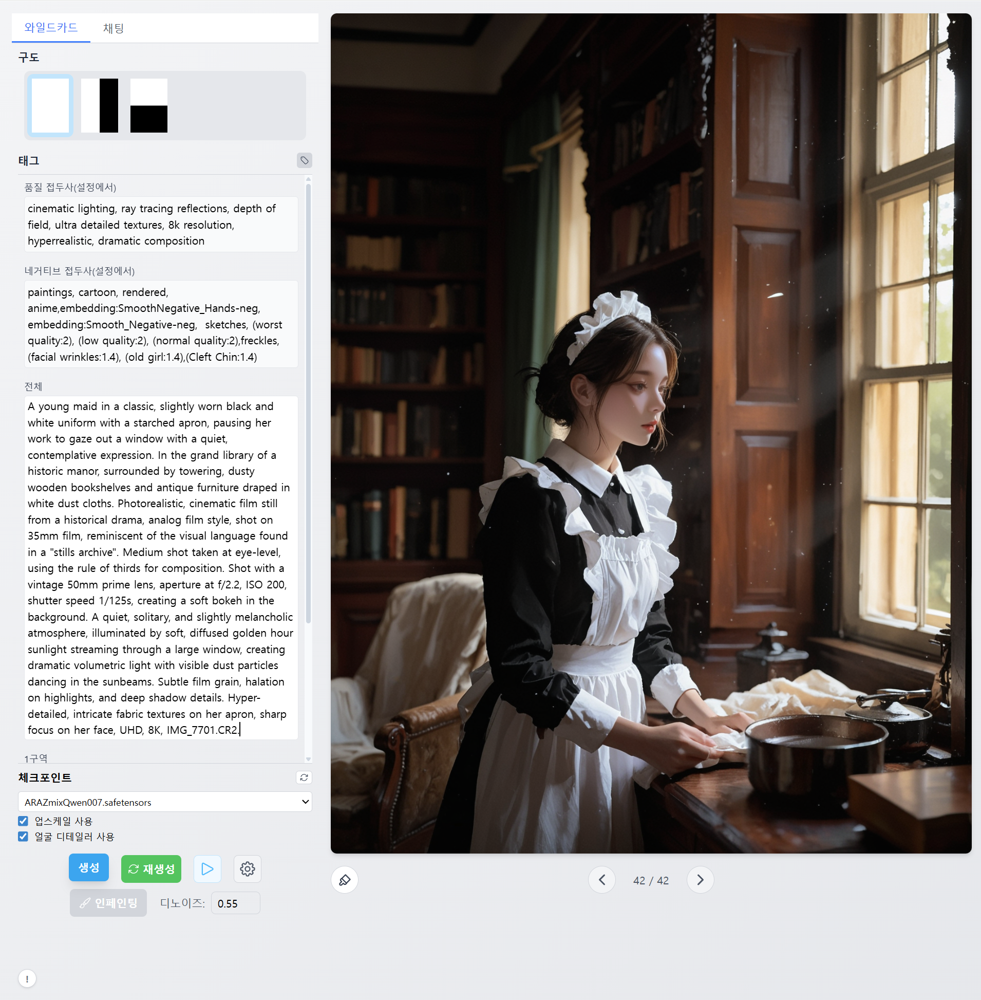
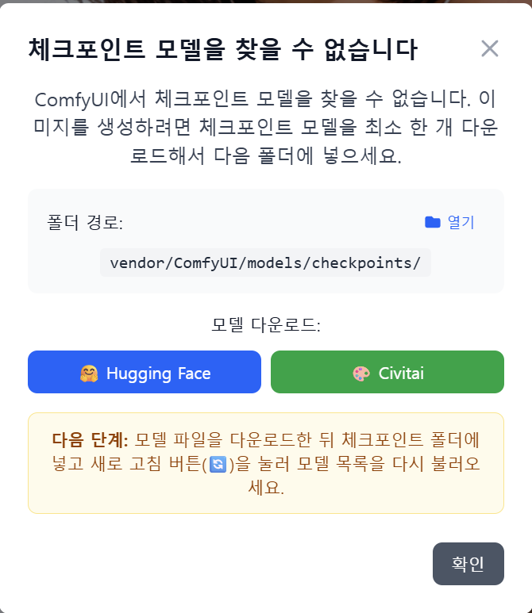
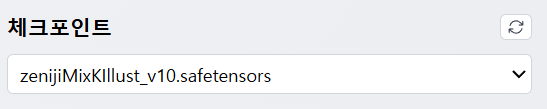
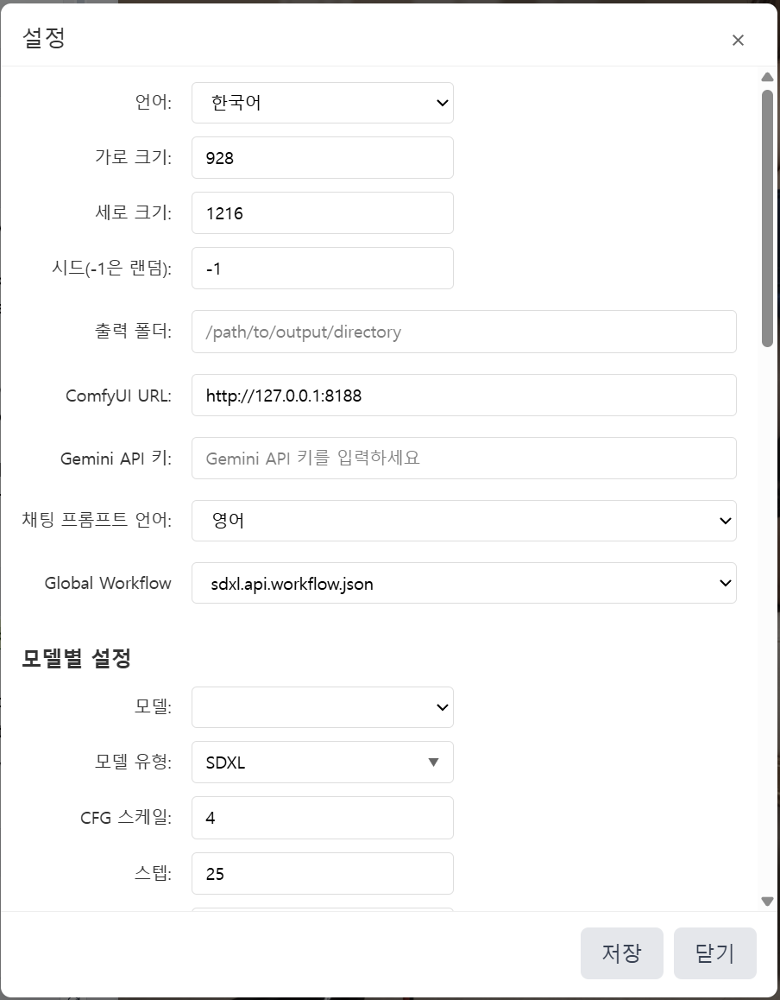
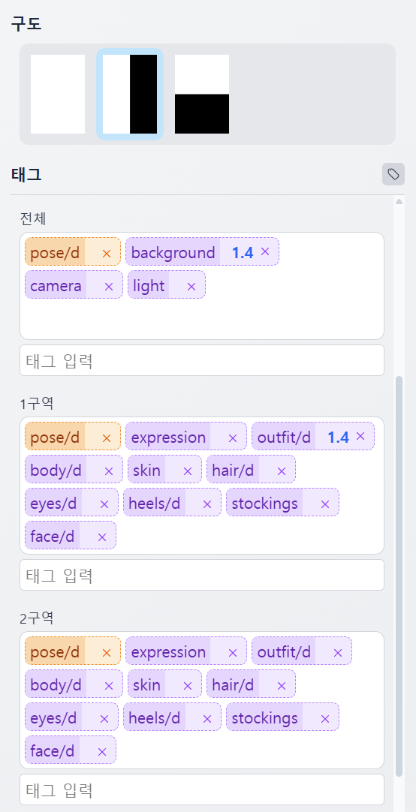
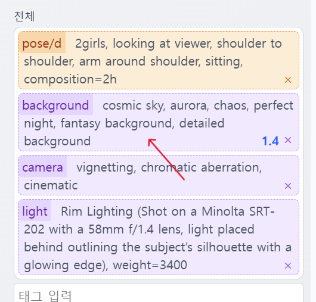
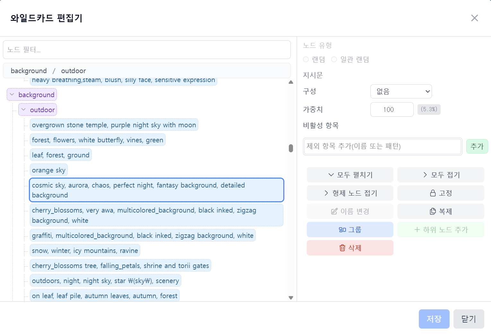

# 태그 페인터

[English](README.md) | 한국어

Tag Painter는 ComfyUI와 연동되는 SvelteKit 기반 웹 애플리케이션입니다. 영역별 프롬프트 구성을 통해 다양한 캐릭터 이미지를 생성할 수 있습니다.

## 설치

### 1. 릴리스 다운로드

- [GitHub Releases](https://github.com/Julian-adv/tag-painter/releases)에서 최신 `tag-painter-release-*.zip` 파일을 받습니다.
- 원하는 위치에 압축을 풉니다.

### 2. 애플리케이션 실행

- Windows: `start.bat`
- macOS/Linux: `bash start.sh`

스크립트를 실행하면 애플리케이션이 자동으로 시작되어 브라우저에서 사용할 수 있습니다.
처음 실행은 환경 준비(ComfyUI 설치/가상환경 구성/모델 다운로드 등)로 인해 시간이 꽤 걸릴 수 있습니다. 자동으로 열리지 않으면 브라우저에서 `http://127.0.0.1:3000/` 을 여세요.

설치가 완료되면 아래와 같은 "체크포인트 없음" 안내 대화상자가 나타날 수 있습니다. 이 경우 Civitai나 Hugging Face에서 체크포인트(베이스 모델) 파일을 내려받아 `ComfyUI/models/checkpoints/` 폴더에 넣어주세요. 파일을 넣은 뒤에는 새로 고침(🔄) 버튼을 눌러 모델 목록을 갱신하면 됩니다.

- Zeniji*Mix K-illust — https://civitai.com/models/1651774?modelVersionId=1869616
  *위 스크린샷은 이 모델로 생성되었습니다.\_

### 설정 열기

상단 도구 모음의 톱니(설정) 버튼을 누르면 설정 창이 열립니다. 여기에서 다음 항목을 변경할 수 있습니다.

- 언어: 한국어/영어 전환
- 이미지 생성 폴더: 출력 디렉터리 경로
- 이미지 생성 파라미터: 샘플러, 스텝 수, CFG 스케일, 시드 등
- 기본 퀄리티 프롬프트: 품질 관련 프리픽스 텍스트
- LoRA 목록: 사용할 LoRA 모델 선택/관리

### 구도와 존 프롬프트

구도(Composition)를 선택해 화면을 여러 존으로 분할할 수 있습니다(예: 수평 2분할, 수직 2분할 등). 각 존에 개별 프롬프트를 입력하면 해당 영역에만 적용됩니다.

- 전체(ALL) 프롬프트: 모든 구역에 공통으로 적용됩니다.
- 1구역/2구역 프롬프트: 각 구역에만 적용되는 태그를 입력합니다.
- 인페인팅 프롬프트: 인페인팅 기능을 사용할 때 적용됩니다.

구도와 존 프롬프트를 함께 사용하면, 인물/배경/의상 등 서로 다른 요소를 영역별로 정교하게 제어할 수 있습니다.

### 태그와 와일드카드 편집

‘생성’ 버튼을 누르면 현재 조합에 따라 실제로 사용될 태그들이 화면에 표시되어, 어떤 태그가 적용되는지 한눈에 확인할 수 있습니다.

태그 영역에서 태그를 더블 클릭하면 와일드카드 편집 대화상자가 열립니다. 태그 구성과 무작위(와일드카드) 설정을 직관적으로 편집할 수 있습니다.

사용법

| 항목                          | 설명                                                                                                                             |
| ----------------------------- | -------------------------------------------------------------------------------------------------------------------------------- |
| 노드 더블 클릭 (Enter)        | 노드 이름/내용을 바로 편집합니다.                                                                                                |
| Ctrl+Enter                    | 선택 노드의 형제 노드를 추가합니다.                                                                                              |
| 드래그 앤 드롭                | 노드의 순서나 위치를 변경합니다.                                                                                                 |
| 랜덤                          | 이미지를 생성할 때마다 후보 중 하나를 무작위로 새로 선택합니다.                                                                  |
| 일관 랜덤                     | 전체(ALL), 1구역, 2구역에도 같은 값이 일관되게 선택됩니다. 인물의 포즈처럼 모든 존에 일관되게 적용되어야 하는 태그에 사용합니다. |
| 구성                          | 이 노드를 사용하면 이미지 생성의 구도를 결정합니다. (하나의 구역, 좌우 분할, 상하 분할이 정해집니다.)                            |
| 가중치                        | 후보 선택 확률을 조절합니다(값이 높을수록 해당 노드가 후보들 중에서 선택될 확률이 높아집니다).                                   |
| 비활성                        | 이름이나 패턴을 추가해 특정 노드(또는 특정 패턴)를 생성에서 제외할 수 있습니다.                                                  |
| 고정                          | 이미지 생성 시 해당 노드를 반드시 선택되도록 고정합니다. 테스트 목적에 좋습니다.                                                 |
| 다중 선택/그룹화 (Shift+클릭) | 범위를 선택하고 ‘그룹’ 버튼으로 선택한 노드들을 자식으로 하는 부모 노드를 추가합니다.                                            |
| 추가/삭제                     | 상단/우클릭 메뉴로 자식 추가, 최상위 추가, 삭제를 할 수 있습니다.                                                                |
| 확장/접기                     | 트리의 모든 노드를 확장/접기하여 구조를 빠르게 확인합니다.                                                                       |

### 자동 설치/설정 항목

- start.bat를 실행하면 ComfyUI와 Python 가상환경이 자동으로 준비됩니다.
- 다음 커스텀 노드가 자동으로 설치됩니다.
  - cgem156-ComfyUI — https://github.com/laksjdjf/cgem156-ComfyUI
  - ComfyUI-Custom-Scripts — https://github.com/pythongosssss/ComfyUI-Custom-Scripts
  - ComfyUI-Impact-Pack — https://github.com/ltdrdata/ComfyUI-Impact-Pack
  - ComfyUI-Impact-Subpack — https://github.com/ltdrdata/ComfyUI-Impact-Subpack
  - ComfyUI_essentials — https://github.com/cubiq/ComfyUI_essentials
  - comfyui_controlnet_aux (OpenPose/DWpose 전처리기) — https://github.com/Fannovel16/comfyui_controlnet_aux
- 추가 Python 패키지:
  - pandas — cgem156-ComfyUI의 WD tagger 기능에 필요합니다.
- 커스텀 노드 동작에 필요한 보조 모델도 자동 다운로드됩니다.
  - YOLO (사람/얼굴):
    - person_yolov8m-seg.pt — https://huggingface.co/Bingsu/adetailer/resolve/main/person_yolov8m-seg.pt
    - face_yolov8m.pt — https://huggingface.co/Bingsu/adetailer/resolve/main/face_yolov8m.pt
  - SAM: sam_vit_b_01ec64.pth — https://huggingface.co/datasets/Gourieff/ReActor/resolve/main/models/sams/sam_vit_b_01ec64.pth
  - VAE: fixFP16ErrorsSDXLLowerMemoryUse_v10.safetensors — https://huggingface.co/moonshotmillion/VAEfixFP16ErrorsSDXLLowerMemoryUse_v10/resolve/main/fixFP16ErrorsSDXLLowerMemoryUse_v10.safetensors
  - ControlNet (OpenPose XL): OpenPoseXL2.safetensors — 우선적으로 Hugging Face에서 시도하며, `ComfyUI/models/controlnet/`에 배치됩니다.
  - ControlNet Aux Annotators:
    - body_pose_model.pth — https://huggingface.co/lllyasviel/Annotators/resolve/main/body_pose_model.pth
    - hand_pose_model.pth — https://huggingface.co/lllyasviel/Annotators/resolve/main/hand_pose_model.pth
    - facenet.pth — https://huggingface.co/lllyasviel/Annotators/resolve/main/facenet.pth
- 예시 LoRA 모델이 자동으로 다운로드되어 `ComfyUI/models/loras/`에 설치됩니다.
  - MoriiMee_Gothic_Niji_Style_Illustrious_r1 — https://huggingface.co/NeigeSnowflake/neigeworkflow/resolve/main/MoriiMee_Gothic_Niji_Style_Illustrious_r1.safetensors
  - spo_sdxl_10ep_4k-data_lora_webui — https://civitai.com/api/download/models/567119
  - Sinozick_Style_XL_Pony — https://civitai.com/api/download/models/481798
  - Fant5yP0ny — https://huggingface.co/LyliaEngine/Fant5yP0ny/resolve/main/Fant5yP0ny.safetensors?download=true

또한 인페인팅에서 사용하는 DWpose/OpenPose 전처리기를 위해 onnxruntime를 자동 설치합니다.

- NVIDIA GPU가 감지되면: `onnxruntime-gpu` 설치(필요 시 `onnxruntime`로 대체)
- 그 외 환경: `onnxruntime` 설치

`OpenPoseXL2.safetensors` 자동 다운로드에 실패하면 수동으로 내려받아 `ComfyUI/models/controlnet/OpenPoseXL2.safetensors` 경로에 넣어주세요.

### 실행 옵션

- `-NoComfy`: 사용자가 이미 설치/실행 중인 ComfyUI를 그대로 사용합니다. ComfyUI 설치/시작을 건너뜁니다.
- `-ComfyOnly`: Tag Painter는 실행하지 않고 ComfyUI만 실행합니다.

## Chroma 워크플로 타이틀

Tag Painter는 Chroma 워크플로를 구성할 때 노드의 `_meta.title`(대소문자 구분, 부분 일치)과 일부 클래스 타입을 기준으로 값을 주입합니다. 아래 타이틀을 워크플로에 1개씩 포함하는 것을 권장합니다.

- 필수(메인 경로)
  - `CLIP Text Encode (Positive Prompt)` — 메인 긍정 프롬프트 텍스트.
  - `CLIP Text Encode (Negative Prompt)` — 메인 부정 프롬프트 텍스트.
  - `Empty Latent Image` — 캔버스 역할의 잠복(latent) 이미지. 가로/세로 크기를 설정에서 적용합니다.
  - `KSampler (Main)` 또는 `KSampler` — 메인 샘플러. 스텝/CFG/샘플러/스케줄러/시드를 적용합니다.
  - `CLIP Set Last Layer` — 선택 사항. CLIP 스킵 레이어를 설정에서 적용합니다.
  - `VAE Decode (Base)` — 업스케일/FaceDetailer를 사용하지 않을 때의 최종 디코드 노드.
  - 메인 모델 로더 — 메인 경로에 `UNETLoader` 노드가 있어야 합니다. 첫 번째 `UNETLoader`의 `unet_name`을 선택한 체크포인트로 설정합니다.

- 선택(페이스 디테일러)
  - `FaceDetailer` — FD 본체 노드. 시드/스텝/CFG/샘플러/스케줄러/디노이즈를 적용합니다. 입력 이미지(`image`)는 업스케일 사용 시 `VAE Decode (Tiled)`에서, 아니면 `VAE Decode (Base)`에서 가져옵니다. 또한 `wildcard` 입력에는 존 1/존 2 프롬프트를 결합해 전달합니다.
  - `Load Checkpoint` — FD용 체크포인트 로더. 모델(0)/CLIP(1)/VAE(2)를 `FaceDetailer`에 제공합니다.
  - `Load VAE` — FD에서 임베디드 VAE를 사용하지 않을 때 쓰는 VAELoader. `vae_name`을 설정에서 적용합니다.
  - `Upscale CLIP Text Encode (Positive)` — FD/업스케일 분기에서 사용하는 긍정 텍스트 인코더.
  - `Upscale CLIP Text Encode (Negative)` — FD/업스케일 분기에서 사용하는 부정 텍스트 인코더.

- 선택(업스케일)
  - `Latent Upscale` — 타깃 잠복 이미지 크기(기본 크기 × 배율)를 설정합니다.
  - `SDXL VAE Encode` — 업스케일 경로의 인코드 노드. 임베디드 또는 외부 `Load VAE`를 설정에 맞게 연결합니다.
  - `KSampler (Upscale)` — 스텝/CFG/샘플러/스케줄러/디노이즈를 적용합니다.
  - `Upscale CLIP Text Encode (Positive)` — 업스케일 분기의 긍정 프롬프트. 텍스트/CLIP 입력을 설정합니다.
  - `Upscale CLIP Text Encode (Negative)` — 업스케일 분기의 부정 프롬프트. 텍스트/CLIP 입력을 설정합니다.
  - `VAE Decode (Tiled)` — 업스케일 분기의 최종 디코드(업스케일 사용 시 출력 소스로 사용됨).

동작 및 참고 사항:

- 타이틀 매칭은 부분 포함, 대소문자 구분입니다. 같은 타이틀을 가진 노드는 하나만 두세요.
- 타이틀이 일부 누락되어도 가능한 경우 클래스 타입으로 보완 설정합니다: `RandomNoise`(시드), `BasicScheduler`(스텝/스케줄러), `CFGGuider`(CFG), `KSamplerSelect`(샘플러), 첫 `UNETLoader`(체크포인트), 첫 `VAELoader`(VAE).
- Chroma 워크플로에서 메인 모델은 `UNETLoader`를 사용합니다. `Load Checkpoint` 타이틀은 FaceDetailer용 하나만 두는 것을 권장합니다.
- 워크플로가 `SamplerCustom` 노드를 사용할 경우(타이틀 `SamplerCustom`), 메인 `KSampler`가 없으면 `cfg` 및 `noise_seed`를 여기에 설정합니다.
- 최종 저장은 고정 ID(`final_save_output`)를 갖는 `SaveImageWebsocket` 노드를 자동 추가합니다. 워크플로에 저장 노드를 포함할 필요가 없습니다.

## Qwen 워크플로 타이틀

Qwen 모델용 워크플로도 노드의 `_meta.title`(부분 일치, 대소문자 구분)을 기준으로 값을 주입합니다. 아래 타이틀을 포함해 고정된 노드 ID에 의존하지 않도록 구성하세요.

- 필수(메인 경로)
  - `KSampler` — 메인 샘플러. 스텝/CFG/샘플러/스케줄러/시드를 적용합니다.
  - `Model Sampling Aura Flow` — UNet/LoRA 체인 뒤의 모델 출력을 받아 `KSampler.model`로 연결됩니다.
  - `Load Qwen UNet` — 기본 UNETLoader. 선택한 체크포인트를 `unet_name`에 반영합니다.
  - `Load Qwen VAE` — VAELoader. VAE를 선택했다면(`__embedded__`가 아닌 경우) 해당 이름을 설정합니다.
  - `CLIP Text Encode (Positive)` — 긍정 프롬프트 텍스트. Qwen CLIP 로더에 연결되어야 합니다.
  - `CLIP Text Encode (Negative)` — 부정 프롬프트 텍스트. Qwen CLIP 로더에 연결되어야 합니다.
  - `Empty Latent Image` — 잠복 캔버스. 가로/세로 크기를 설정합니다.
  - `VAE Decode` — 업스케일/FaceDetailer를 사용하지 않을 때 사용하는 베이스 디코드 노드.

- 선택(페이스 디테일러)
  - 항상:
    - `FaceDetailer` — FD 본체 노드. 시드/스텝/CFG/샘플러/스케줄러/디노이즈를 적용합니다.
    - `FaceDetailer CLIP Text Encode (Positive)` — FD 긍정 프롬프트(텍스트와 CLIP 입력 연결).
    - `FaceDetailer CLIP Text Encode (Negative)` — FD 부정 프롬프트(텍스트와 CLIP 입력 연결).
    - 입력 이미지 연결: 업스케일 사용 시 `VAE Decode (Tiled)`, 아니면 베이스 `VAE Decode`.
  - Qwen FD 경로:
    - `FaceDetailer UNet Loader (Qwen)` — FD용 UNETLoader. 체크포인트를 설정합니다.
    - `FaceDetailer Model Sampling Aura Flow (Qwen)` — FD용 모델 샘플링 래퍼. `FaceDetailer`의 model 입력에 연결됩니다.
    - `FaceDetailer CLIP Loader (Qwen)` — FD용 CLIP 로더. `FaceDetailer`와 FD 텍스트 인코더에 연결됩니다.
    - `FaceDetailer VAE Loader (Qwen)` — FD용 VAE 로더. `FaceDetailer`의 VAE 입력과 이름을 설정합니다.
  - SDXL FD 경로:
    - `FaceDetailer Checkpoint Loader (SDXL)` — 체크포인트 로더. model(0)/clip(1)/vae(2)를 `FaceDetailer`에 제공합니다.
    - `FaceDetailer VAE Loader (SDXL)` — 체크포인트 임베디드 VAE를 쓰지 않을 때 사용하는 외부 VAE 로더.

- 선택(업스케일)
  - `Latent Upscale` — 기본 크기 × 배율로 잠복 이미지 크기를 설정합니다.
  - `SDXL VAE Encode` — 업스케일 경로의 인코드 노드. 설정에 맞게 VAE 입력을 연결합니다.
  - `KSampler (Upscale)` — 스텝/CFG/샘플러/스케줄러/디노이즈를 적용하고, 모델 입력을 업스케일 경로에 맞게 연결합니다.
  - Qwen 업스케일 경로:
    - `Upscale UNet Loader (Qwen)` — 업스케일용 UNETLoader. 체크포인트를 설정합니다.
    - `Upscale Model Sampling Aura Flow (Qwen)` — 업스케일용 모델 샘플링 래퍼. `KSampler (Upscale)`의 model 입력에 연결됩니다.
    - `Upscale CLIP Loader (Qwen)` — 업스케일용 CLIP 로더.
    - `Upscale VAE Loader (Qwen)` — 업스케일용 VAE 로더. 이름을 설정하며 인코드/디코드 모두에서 사용합니다.
    - `Upscale CLIP Text Encode (Positive)` — 업스케일 긍정 프롬프트. 텍스트/CLIP 입력을 설정합니다.
    - `Upscale CLIP Text Encode (Negative)` — 업스케일 부정 프롬프트. 텍스트/CLIP 입력을 설정합니다.
    - `VAE Decode (Tiled)` — 업스케일 분기의 최종 디코드 노드.
  - SDXL 업스케일 경로:
    - `Upscale Checkpoint Loader (SDXL)` — 업스케일 경로에 model(0)/clip(1)/vae(2)를 제공합니다.
    - `Upscale VAE Loader (SDXL)` — 체크포인트 임베디드 VAE를 사용하지 않을 때 쓰는 외부 VAE 로더.
    - `Upscale CLIP Text Encode (Positive)` — 업스케일 긍정 프롬프트. 텍스트/CLIP 입력을 설정합니다.
    - `Upscale CLIP Text Encode (Negative)` — 업스케일 부정 프롬프트. 텍스트/CLIP 입력을 설정합니다.
    - `VAE Decode (Tiled)` — 업스케일 분기의 최종 디코드 노드.

동작 및 참고 사항:

- LoRA 체인: Tag Painter가 `Load Qwen UNet`과 `Model Sampling Aura Flow` 사이에 `LoraLoaderModelOnly` 노드(타이틀 `Load Qwen LoRA N`)를 자동 삽입/연결합니다.
- 타이틀 매칭은 부분 포함, 대소문자 구분입니다. 각 타이틀별로 한 개의 노드만 두세요.
- 타이틀이 누락되면 일부 경로에서 기본 ID로 동작할 수 있으나, 안정적인 동작을 위해 위 타이틀 구성을 권장합니다.
- 최종 저장 노드는 고정 ID(`final_save_output`)로 `SaveImageWebsocket`을 자동 추가합니다. 워크플로에 저장 노드를 포함할 필요가 없습니다.

## 라이선스

이 프로젝트는 오픈 소스입니다. 자세한 내용은 LICENSE 파일을 참조하세요.
