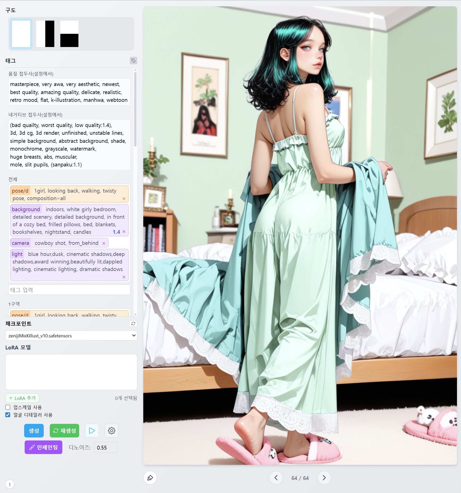
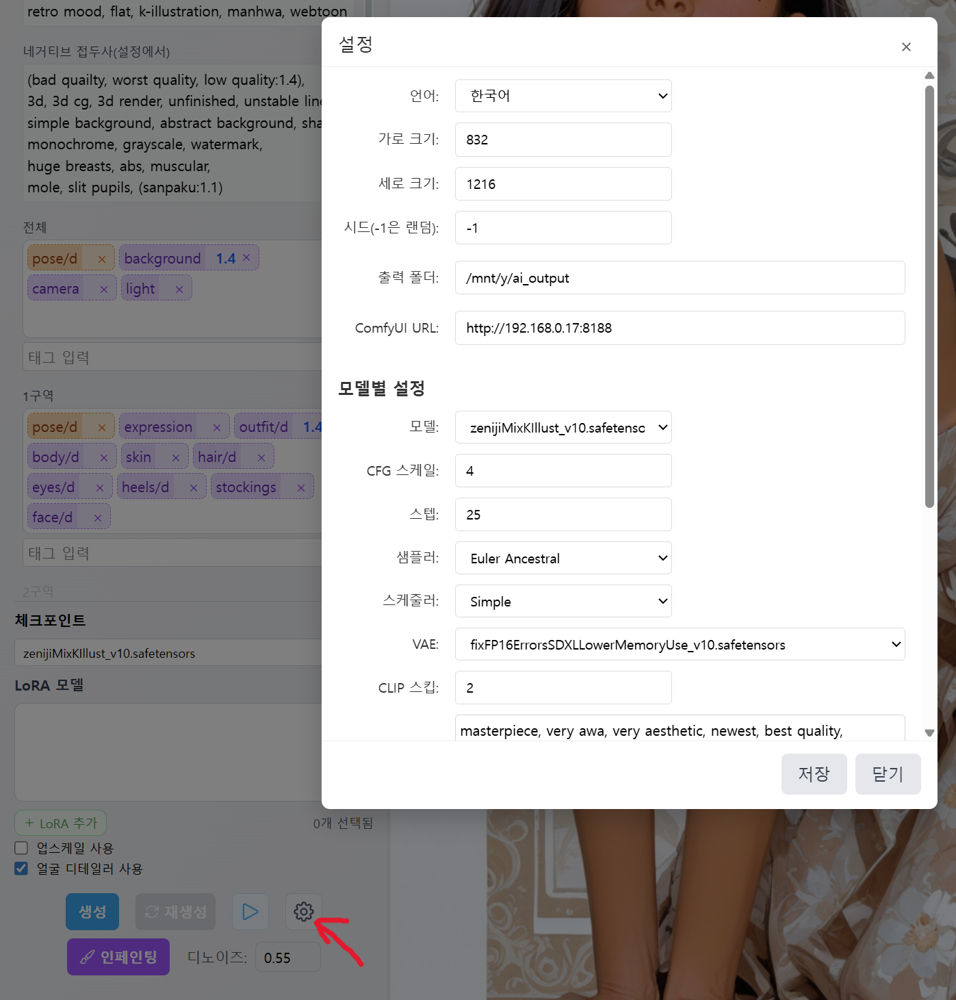

# 태그 페인터

[English](README.md) | 한국어

Tag Painter는 ComfyUI와 연동되는 SvelteKit 기반 웹 애플리케이션입니다. 영역별 프롬프트 구성을 통해 다양한 캐릭터 이미지를 생성할 수 있습니다. 또한 Gemini와 채팅을 통해 이미지를 생성하거나 캐릭터 카드를 만들 수 있습니다.

## 주요 기능

- ComfyUI 실행에 필요한 어플들 설치(Node, Git, Python)
- ComfyUI 설치
- 커스텀 노드 설치
- 이미지 생성 모델 다운로드
- 와일드카드 이용한 이미지 생성
- 와일드카드 편집
- 채팅으로 캐릭터카드 생성

## 설치

### 다운로드

- [GitHub Releases](https://github.com/Julian-adv/tag-painter/releases)에서 최신 `tag-painter-release-*.zip` 파일을 받습니다.
- 원하는 위치에 압축을 풉니다.

### 애플리케이션 실행

- Windows: 압축 푼 폴더에서 `start.bat` 실행
- macOS/Linux: 압축 푼 폴더에서 `bash start.sh` 실행

start.bat 스크립트를 실행하면 애플리케이션이 시작되어 브라우저에서 http://127.0.0.1:3000/ 이 열립니다.
처음 실행은 환경 준비(Node/Git/Python/ComfyUI 설치/가상환경 구성)로 인해 시간이 꽤 걸릴 수 있습니다.

브라우저가 열리면 아래와 같은 "커스텀 노드 설치" 안내 대화상자가 나타납니다. ComfyUI를 사용하는데 필요한 커스텀 노드들이니 설치 버튼을 눌러 설치를 합니다. 시간이 꽤 걸릴 수 있습니다.

설치가 끝나고 나면 다음과 같이 ComfyUI 시작 버튼이 나오는데 누르면 ComfyUI가 뒷단에서 실행됩니다.

  
다음은 각종 모델 파일들을 다운로드 받는데, 필수적으로 필요한 파일들을 받는 1단계와 크기가 큰 모델 파일들을 받는 2단계로 나뉘어져 있습니다. 1단계 다운로드를 눌러 다운로드를 시작합니다.

2단계 파일들은 본인이 이미 갖고 있는 파일들이 있으면 건너뛰고 본인의 파일들은 복사해 넣어도 됩니다. (`tag-painter\vendor\ComfyUI\models\checkpoints` 혹은 `...\diffusion_models` 혹은 `...\loras`)

## 이미지 생성

### 와일드카드 탭

data/wildcards.yaml (모델이 qwen이면 wildcards.qwen.yaml)을 이용해서 이미지를 생성합니다.

### 구도와 존 프롬프트

구도(Composition)를 선택해 화면을 여러 존으로 분할할 수 있습니다(예: 수평 2분할, 수직 2분할 등). 각 존에 개별 프롬프트를 입력하면 해당 영역에만 적용됩니다.

- 전체(ALL) 프롬프트: 모든 구역에 공통으로 적용됩니다.
- 1구역/2구역 프롬프트: 각 구역에만 적용되는 태그를 입력합니다.
- 인페인팅 프롬프트: 인페인팅 기능을 사용할 때 적용됩니다.

구도와 존 프롬프트를 함께 사용하면, 인물/배경/의상 등 서로 다른 요소를 영역별로 제어할 수 있습니다.

### 태그와 와일드카드 편집

‘생성’ 버튼을 누르면 현재 조합에 따라 실제로 사용될 태그들이 화면에 표시되어, 어떤 태그가 적용되는지 한눈에 확인할 수 있습니다.

태그 영역에서 태그를 더블 클릭하면 와일드카드 편집 대화상자가 열립니다. 태그 구성과 무작위(와일드카드) 설정을 직관적으로 편집할 수 있습니다.

사용법

| 항목                          | 설명                                                                                                                             |
| ----------------------------- | -------------------------------------------------------------------------------------------------------------------------------- |
| 노드 더블 클릭 (Enter)        | 노드 이름/내용을 바로 편집합니다.                                                                                                |
| Ctrl+Enter                    | 선택 노드의 형제 노드를 추가합니다.                                                                                              |
| 드래그 앤 드롭                | 노드의 순서나 위치를 변경합니다.                                                                                                 |
| 랜덤                          | 이미지를 생성할 때마다 후보 중 하나를 무작위로 새로 선택합니다.                                                                  |
| 일관 랜덤                     | 전체(ALL), 1구역, 2구역에도 같은 값이 일관되게 선택됩니다. 인물의 포즈처럼 모든 존에 일관되게 적용되어야 하는 태그에 사용합니다. |
| 구성                          | 이 노드를 사용하면 이미지 생성의 구도를 결정합니다. (하나의 구역, 좌우 분할, 상하 분할이 정해집니다.)                            |
| 가중치                        | 후보 선택 확률을 조절합니다(값이 높을수록 해당 노드가 후보들 중에서 선택될 확률이 높아집니다).                                   |
| 비활성                        | 이름이나 패턴을 추가해 특정 노드(또는 특정 패턴)를 생성에서 제외할 수 있습니다.                                                  |
| 고정                          | 이미지 생성 시 해당 노드를 반드시 선택되도록 고정합니다. 테스트 목적에 좋습니다.                                                 |
| 다중 선택/그룹화 (Shift+클릭) | 범위를 선택하고 ‘그룹’ 버튼으로 선택한 노드들을 자식으로 하는 부모 노드를 추가합니다.                                            |
| 추가/삭제                     | 상단/우클릭 메뉴로 자식 추가, 최상위 추가, 삭제를 할 수 있습니다.                                                                |
| 확장/접기                     | 트리의 모든 노드를 확장/접기하여 구조를 빠르게 확인합니다.                                                                       |

### 채팅

Gemini API를 이용해서 캐릭터 카드를 생성할 수 있습니다. 생성된 캐릭터 카드는 [RisuAI](https://github.com/kwaroran/RisuAI)에서 사용할 수 있습니다. Gemini API key가 필요합니다. [Google AI Studio](https://aistudio.google.com/)에서 무료키를 얻을 수 있습니다.

## 설정

생성 버튼 옆에 톱니(설정) 버튼을 누르면 설정 창이 열립니다. 여기에서 다음 항목을 변경할 수 있습니다.

- 언어: 한국어/영어 전환
- 출력 폴더: 출력 디렉터리 경로
- ComfyUI URL: 자신만의 ComfyUI에 접속할 때 사용합니다.
- Gemini API 키: 채팅으로 이미지 생성할 때 필요합니다.
- 채팅 프롬프트 언어: Gemini가 생성한 이미지 프롬프트에서 중국어/영어 중 선택할 수 있습니다.
- Global Workflow: 워크플로우가 따로 저장되지 않은 모델들이 사용할 워크플로우를 지정합니다.
- 모델별 설정: 샘플러, 스텝 수, CFG 스케일, 시드 등
- 기본 퀄리티 프롬프트: 품질 관련 프리픽스 텍스트
- LoRA 목록: 사용할 LoRA 모델 선택/관리

## 커스텀 워크플로

워크플로 파일들은 data/workflow 폴더에 있습니다. ComfyUI에서 읽어들일 수 있는 워크플로우 파일들은 data/examples 폴더에 있습니다. 새로운 워크플로우를 만들 때 참고하세요. 이미지 생성에 사용하려면 ComfyUI에서 api 형태로 export 해서 data/workflow 폴더에 넣으면 됩니다. 이미지 생성할 때 타이틀을 이용해서 노드를 찾아서 파라메터를 설정하므로 타이틀을 똑같이 하는 것이 필요합니다.

## 라이선스

이 프로젝트는 오픈 소스입니다. 자세한 내용은 LICENSE 파일을 참조하세요.
