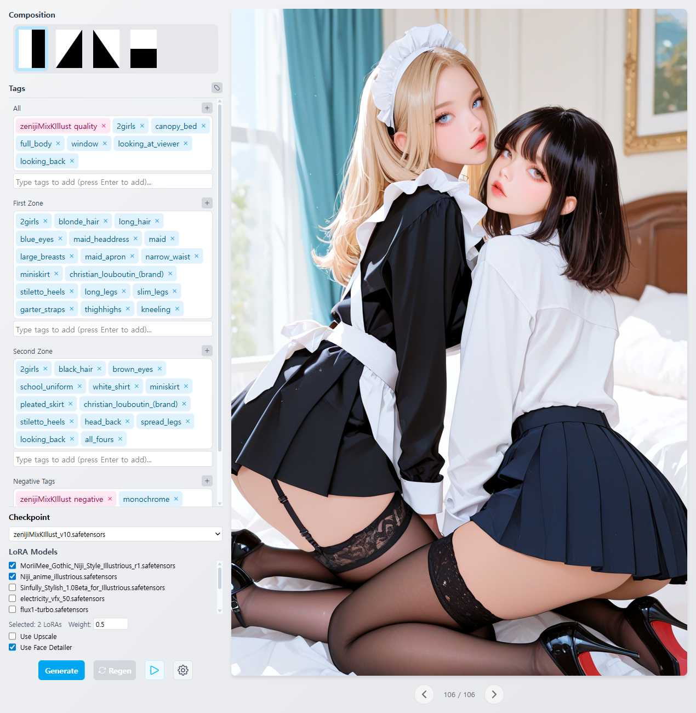

# Tag Painter

Tag Painter is a SvelteKit-based web application that integrates with ComfyUI for AI image generation. Create diverse character art using zone-based prompting with regional composition control.



## Installation

### 1. Prerequisites

- **Node.js** (v22 or higher) - [Download from nodejs.org](https://nodejs.org/)
- **Git** - For cloning the repository - [Download from git-scm.com](https://git-scm.com/)

### 2. Clone Repository

```bash
git clone https://github.com/Julian-adv/tag-painter
cd tag-painter
```

### 3. Install Dependencies

```bash
npm install
```

### 4. ComfyUI Setup

This application requires a local ComfyUI instance:

- **ComfyUI Portable** - [Download from comfyanonymous/ComfyUI releases](https://github.com/comfyanonymous/ComfyUI/releases)
- ComfyUI must be running at `http://127.0.0.1:8188`
- The following nodes must be installed:
  - **SaveImageWebsocket** - For real-time image delivery
  - **FaceDetailer** - For face enhancement (optional)
  - **AttentionCouple** - For regional prompting
  - **UltralyticsDetectorProvider** - For face detection
  - **SAMLoader (Impact)** - For segmentation
  - Standard ComfyUI nodes (CheckpointLoaderSimple, CLIPTextEncode, etc.)

**Easy Setup**: 
1. Load `docs/example-workflow.json` into your ComfyUI interface
2. Use **ComfyUI Manager** to install any missing nodes automatically
3. If the workflow runs successfully, ComfyUI is properly configured

### 5. Development Server

```bash
npm run dev
```

Then open your browser and navigate to `http://localhost:5173`

Or to automatically open in browser:

```bash
npm run dev -- --open
```


## Example Model Files

The screenshot above was generated using these models. Download and place them in your ComfyUI directories:

### Base Model
- **Zeniji_Mix K-illust** - [Download from Civitai](https://civitai.com/models/1651774?modelVersionId=1869616)
  - Place in `ComfyUI/models/checkpoints/`

### LoRA Models  
- **MoriiMee Gothic Niji Lora** - [Download from Civitai](https://civitai.com/models/915918?modelVersionId=1244133)
  - Place in `ComfyUI/models/loras/`
- **Niji anime style illustrious lora** - [Download from Civitai](https://civitai.com/models/1261988?modelVersionId=1939768)
  - Place in `ComfyUI/models/loras/`

## Troubleshooting

### Common Issues
1. **ComfyUI not running** - Ensure ComfyUI is started at `http://127.0.0.1:8188`
2. **Missing nodes** - Install required custom nodes listed above
3. **No checkpoints** - Place model files in ComfyUI's `models/checkpoints/` directory
4. **Generation fails** - Check ComfyUI console for workflow errors

### File Locations
- Generated images: `data/output/YYYY-MM-DD/`
- Settings: `data/settings.json`
- Tag database: `data/danbooru_tags.txt`

## License

This project is open source. See the LICENSE file for details.
