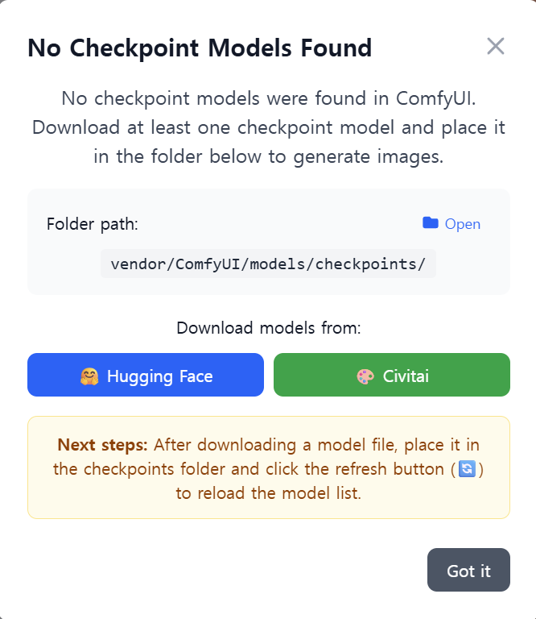
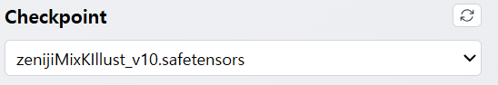

# Tag Painter

English | [한국어](README.ko.md)

Tag Painter is a SvelteKit-based web application that integrates with ComfyUI for AI image generation. Create diverse character art using zone-based prompting with regional composition control.

## Installation

### 1. Download Release

- Get the latest `tag-painter-release-*.zip` from GitHub Releases: https://github.com/Julian-adv/tag-painter/releases
- Extract it to any folder you like.

### 2. Start Application

- Windows: `start.bat`
- macOS/Linux: `bash start.sh`

The script starts the app and opens it in your browser. The first launch can take a while due to environment setup (ComfyUI installation/venv setup/model downloads).
If it doesn't open automatically, go to `http://127.0.0.1:3000/`.

After installation, you may see a "No checkpoints" dialog. In that case, download a checkpoint (base model) from Civitai or Hugging Face and place it in `ComfyUI/models/checkpoints/`. After placing the file, click the refresh (🔄) button to reload the model list.

- Zeniji*Mix K-illust — https://civitai.com/models/1651774?modelVersionId=1869616
  \_The screenshot above was generated with this model.*

### Open Settings

Click the gear (Settings) button in the top toolbar to open the settings dialog. You can configure:

- Language: switch between English/Korean
- Output folder: image generation output directory
- Generation parameters: sampler, steps, CFG scale, seed, etc.
- Default quality prompt: quality-related prefix text
- LoRA list: select/manage LoRA models

### Composition & Zone Prompts

Choose a composition to split the canvas into zones (e.g., left/right or top/bottom). Enter prompts for each zone to apply them only to that region.

- ALL prompt: applies to every zone.
- Zone 1 / Zone 2 prompts: apply only to the respective zone.
- Inpainting prompt: used when you perform inpainting.

Using composition with per-zone prompts lets you control different elements (character, background, outfit, etc.) precisely by region.

### Tags & Wildcards Editor

When you press Generate, the UI shows which tags will actually be used based on the current combination so you can verify them at a glance.

Double-click a tag to open the wildcards editor and fine‑tune random choices.

Usage

| Item                             | Description                                                                                                                                      |
| -------------------------------- | ------------------------------------------------------------------------------------------------------------------------------------------------ |
| Node double-click (Enter)        | Edit the node name/content inline.                                                                                                               |
| Ctrl+Enter                       | Add a sibling node next to the current node.                                                                                                     |
| Drag & drop                      | Reorder or move nodes.                                                                                                                           |
| Random                           | Picks a new candidate at random on every generation.                                                                                             |
| Consistent random                | Picks the same candidate across ALL, Zone 1, and Zone 2 for the same seed/structure (useful for poses or elements that must match across zones). |
| Composition                      | Determines the image layout: single zone, left/right split, or top/bottom split.                                                                 |
| Weight                           | Controls selection probability (higher weight increases the chance this node is chosen among candidates).                                        |
| Disable                          | Exclude specific nodes (or patterns) from generation.                                                                                            |
| Multi‑select/Group (Shift+click) | Select a range, then press Group to create a parent with the selected nodes as children.                                                         |
| Add/Delete                       | Use the toolbar/context menu to add a child, add a top‑level node, or delete.                                                                    |
| Expand/Collapse                  | Expand/collapse all nodes to review the structure quickly.                                                                                       |
| Pin                              | Force a node to be selected during generation.                                                                                                   |

### What Gets Installed Automatically

- ComfyUI with a Python venv (created/fixed as needed).
- Required custom nodes:
  - cgem156-ComfyUI — https://github.com/laksjdjf/cgem156-ComfyUI
  - ComfyUI-Custom-Scripts — https://github.com/pythongosssss/ComfyUI-Custom-Scripts
  - ComfyUI-Impact-Pack — https://github.com/ltdrdata/ComfyUI-Impact-Pack
  - ComfyUI-Impact-Subpack — https://github.com/ltdrdata/ComfyUI-Impact-Subpack
  - ComfyUI_essentials — https://github.com/cubiq/ComfyUI_essentials
  - comfyui_controlnet_aux (OpenPose/DWpose preprocessors) — https://github.com/Fannovel16/comfyui_controlnet_aux
- Additional Python packages:
  - pandas — required by the WD tagger utilities in cgem156-ComfyUI
- Helper models for the above nodes:
  - YOLO (person/face):
    - person_yolov8m-seg.pt — https://huggingface.co/Bingsu/adetailer/resolve/main/person_yolov8m-seg.pt
    - face_yolov8m.pt — https://huggingface.co/Bingsu/adetailer/resolve/main/face_yolov8m.pt
  - SAM: sam_vit_b_01ec64.pth — https://huggingface.co/datasets/Gourieff/ReActor/resolve/main/models/sams/sam_vit_b_01ec64.pth
  - VAE: fixFP16ErrorsSDXLLowerMemoryUse_v10.safetensors — https://huggingface.co/moonshotmillion/VAEfixFP16ErrorsSDXLLowerMemoryUse_v10/resolve/main/fixFP16ErrorsSDXLLowerMemoryUse_v10.safetensors
  - ControlNet (OpenPose XL): OpenPoseXL2.safetensors — attempts from Hugging Face; placed in `ComfyUI/models/controlnet/`
  - ControlNet Aux annotators:
    - body_pose_model.pth — https://huggingface.co/lllyasviel/Annotators/resolve/main/body_pose_model.pth
    - hand_pose_model.pth — https://huggingface.co/lllyasviel/Annotators/resolve/main/hand_pose_model.pth
    - facenet.pth — https://huggingface.co/lllyasviel/Annotators/resolve/main/facenet.pth
- Example LoRA models downloaded to `ComfyUI/models/loras/`:
  - MoriiMee_Gothic_Niji_Style_Illustrious_r1 — https://huggingface.co/NeigeSnowflake/neigeworkflow/resolve/main/MoriiMee_Gothic_Niji_Style_Illustrious_r1.safetensors
  - spo_sdxl_10ep_4k-data_lora_webui — https://civitai.com/api/download/models/567119
  - Sinozick_Style_XL_Pony — https://civitai.com/api/download/models/481798
  - Fant5yP0ny — https://huggingface.co/LyliaEngine/Fant5yP0ny/resolve/main/Fant5yP0ny.safetensors?download=true

In addition, the setup installs onnxruntime for the DWpose/OpenPose preprocessors used by inpainting:

- If an NVIDIA GPU is detected: installs `onnxruntime-gpu` (falls back to `onnxruntime` if needed)
- Otherwise: installs `onnxruntime`

If auto-download of `OpenPoseXL2.safetensors` fails, download it manually and place it at `ComfyUI/models/controlnet/OpenPoseXL2.safetensors`.

### Run Options

- `-NoComfy`: Use your existing ComfyUI; skip install/start.
- `-ComfyOnly`: Start only ComfyUI; do not launch Tag Painter.

## License

This project is open source. See the LICENSE file for details.
