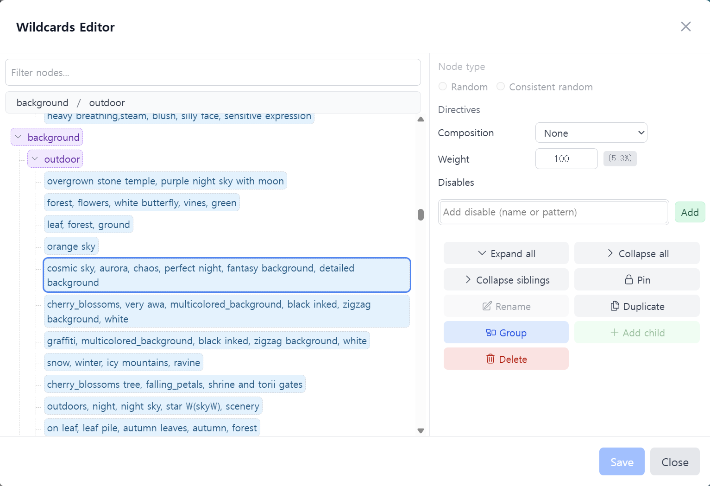

# Tag Painter

English | [한국어](README.ko.md)

Tag Painter is a SvelteKit-based web application that integrates with ComfyUI. Build diverse character art with zone-based prompts, edit wildcard trees, or generate character cards through a Gemini-powered chat workflow.

## Key Features

- Install the applications needed to run ComfyUI (Node.js, Git, Python)
- Install ComfyUI itself
- Install required custom nodes
- Download image-generation models
- Generate images with wildcards
- Edit wildcard definitions visually
- Create character cards through chat

## Installation

### Download

- Download the latest `tag-painter-release-*.zip` from [GitHub Releases](https://github.com/Julian-adv/tag-painter/releases).
- Extract the archive anywhere you like.

### Run the application

- Windows: run `start.bat` inside the extracted folder.
- macOS/Linux: run `bash start.sh` inside the extracted folder.

Running `start.bat` launches the app and opens `http://127.0.0.1:3000/` in your browser. The first launch can take a while because it sets up Node/Git/Python, installs ComfyUI, and creates the virtual environment.

When the browser opens you will see the “Custom Nodes” dialog. These nodes are required for ComfyUI, so click **Install** and wait for the process to finish—it can take some time.

After the installation completes you will see a **Start ComfyUI** button. Click it to launch ComfyUI in the background.

Next, download the model files. Step 1 contains the essential downloads; click **Download Step 1** to begin.

Step 2 contains large models. If you already have those files, you can skip the download and copy your own models into `tag-painter/vendor/ComfyUI/models/checkpoints`, `.../diffusion_models`, or `.../loras`.

## Image Generation

### Wildcards tab

Images are generated from `data/wildcards.yaml` (or `data/wildcards.qwen.yaml` when you use a Qwen model).

### Composition and Zone Prompts

Choose a composition (layout) to split the canvas into multiple zones (for example, horizontal split or vertical split). Prompts entered for each zone only apply to that region.

- **ALL prompt** applies everywhere.
- **Zone 1 / Zone 2 prompts** apply only to their respective zones.
- **Inpainting prompt** is used when you enable inpainting.

Combining compositions with zone prompts lets you control characters, backgrounds, outfits, and other elements per region.

### Tags and Wildcards Editor

When you press **Generate**, the UI shows the actual tags that will be used so you can confirm the combination.

Double-click a tag to open the wildcards editor, where you can edit structures and randomization visually.

Usage

| Item                             | Description                                                                                                      |
| -------------------------------- | ---------------------------------------------------------------------------------------------------------------- |
| Node double-click (Enter)        | Edit the node name or content inline.                                                                            |
| Ctrl+Enter                       | Add a sibling node next to the current node.                                                                     |
| Drag & drop                      | Reorder or move nodes.                                                                                           |
| Random                           | Picks a new candidate at random each time you generate an image.                                                 |
| Consistent random                | Selects the same value across ALL, Zone 1, and Zone 2. Use this for poses or tags that must match in every zone. |
| Composition                      | Determines the layout (single zone, left/right split, top/bottom split).                                         |
| Weight                           | Adjusts selection probability (higher weight = higher chance of being chosen).                                   |
| Disable                          | Exclude specific nodes or patterns from generation.                                                              |
| Pin                              | Force a node to be selected every time—useful when testing.                                                      |
| Multi-select/Group (Shift+click) | Select a range and press **Group** to wrap them inside a parent node.                                            |
| Add/Delete                       | Use the toolbar or context menu to add children, add top-level nodes, or delete selections.                      |
| Expand/Collapse                  | Expand or collapse the entire tree to review the structure quickly.                                              |

### Chat

Use the Gemini API to generate character cards. The cards work with [RisuAI](https://github.com/kwaroran/RisuAI). You need a Gemini API key, which you can obtain for free from [Google AI Studio](https://aistudio.google.com/).

## Settings

Click the gear (settings) button next to Generate to open the settings dialog. You can change:

- Language: English/Korean
- Output folder: where generated images are saved
- ComfyUI URL: point to your own ComfyUI instance
- Gemini API key: required for chat-based image or card generation
- Chat prompt language: pick English or Chinese for Gemini prompts
- Global Workflow: select the workflow to use when a model does not have its own saved workflow
- Per-model settings: sampler, steps, CFG scale, seed, etc.
- Default quality prompt: quality-related prefix text
- LoRA list: manage LoRA models

## Custom Workflows

Workflow files live under `data/workflow`. Example workflows that ComfyUI can load are located in `data/examples`. When you create a new workflow, export it from ComfyUI in API format and place the file inside `data/workflow` so Tag Painter can use it. When generating images, the app locates nodes by title to set their parameters, so the titles need to match exactly.

## License

This project is open source. See the LICENSE file for details.
